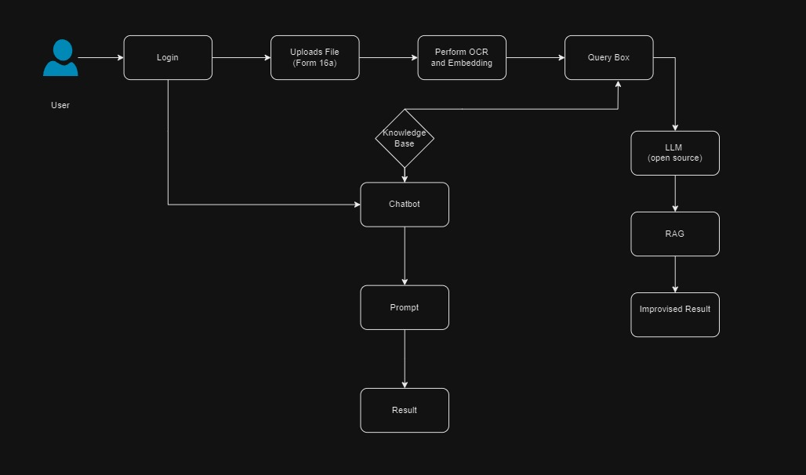

# TaxCraft-CodeRanges
## Team : Code Rangers

#### TaxCraft, the Machine Learning-Enhanced Automated Tax Assistant revolutionizes tax filing, employing advanced algorithms to simplify and personalize the process. By integrating user profiles, smart questionnaires, and personalized suggestion , it ensures efficiency and accuracy. Document organization, tax optimization, and dynamic compliance updates are automated through ML, promoting accessibility for users with varying financial knowledge.

## Technologies Used
- Python
- streamlit
- LLMs: Gemini api
- OCR: teseract
- Vector DB: FASSI
- GPT4 API



### Running the code:
```text
streamlit run app.py
streamlit run login.py
```
